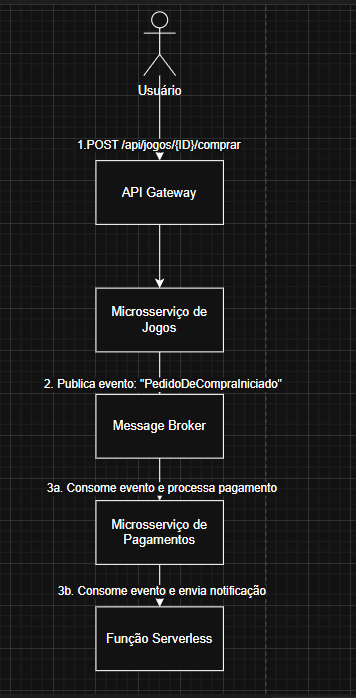

# 🎮 FIAP - Tech Challenge 3: Arquitetura de Microsserviços

Projeto desenvolvido individualmente para o **Tech Challenge de Arquitetura de Sistemas - FIAP Pós Tech**.

## 📌 Descrição

Esta é a terceira fase do projeto **FIAP Cloud Games**, focada na evolução de uma aplicação monolítica para uma arquitetura distribuída baseada em **microsserviços**. O objetivo foi refatorar a API REST original, separando-a em serviços independentes que se comunicam de forma assíncrona, garantindo maior escalabilidade, resiliência e observabilidade para a solução.

---

## 🏛️ Arquitetura Desenhada

A solução foi desacoplada em uma API Web, que serve como porta de entrada para os usuários (frontend), e um Worker Service de background, que processa tarefas assíncronas. A comunicação entre eles é feita através de um barramento de serviço na nuvem.

**[⚠️ AÇÃO: INSERIR A IMAGEM DO SEU DIAGRAMA DE ARQUITETURA AQUI! ⚠️]**

### Fluxo Principal (Simulação de Compra)

1.  O usuário, autenticado via JWT, faz uma requisição HTTP para a **API de Jogos** (hospedada no Azure App Service).
2.  A API valida a requisição e publica um evento `PedidoDeCompraIniciado` em uma fila no **Azure Service Bus**.
3.  O **Worker de Pagamentos** (hospedado no Azure Container Apps), que está constantemente escutando a fila, consome a mensagem do evento.
4.  O Worker simula o processamento do pagamento e registra logs da operação.
5.  Toda a transação, desde a chamada na API até o processamento no Worker, é monitorada de ponta a ponta com **Azure Application Insights**, utilizando rastreamento distribuído para correlacionar as operações.

---

## 🛠️ Tecnologias Utilizadas

-   **.NET 8**:
    -   ASP.NET Core (para a Web API)
    -   Worker Service (para o serviço de background)
-   **Entity Framework Core**: Para acesso a dados.
-   **Arquitetura**: Microsserviços, API REST, Mensageria, Event-Driven.
-   **Containerização**: Docker.
-   **Microsoft Azure**:
    -   **Azure App Service**: Para hospedar a Web API.
    -   **Azure Container Apps**: Para hospedar o Worker Service em contêiner.
    -   **Azure SQL Database**: Banco de dados relacional gerenciado.
    -   **Azure Service Bus**: Para comunicação assíncrona via filas.
    -   **Azure Application Insights**: Para monitoramento, logs e rastreamento distribuído.
    -   **Azure Container Registry**: Para armazenamento das imagens Docker.
-   **Autenticação**: JWT (JSON Web Token).
-   **DevOps**: Git, GitHub, Azure CLI.

---

## 🚀 Aplicações na Nuvem

As aplicações foram publicadas de forma independente no Azure:

-   **API de Jogos (App Service):** A documentação interativa (Swagger UI) pode ser acessada em:
    **(https://fiap-cloudgames-api-lucas-fiubmcvkhle7bi7.brazilsouth-01.azurewebsites.net/swagger/index.html)**

-   **Worker de Pagamentos (Container App):** Este é um serviço de background e não possui uma interface pública. Seu funcionamento pode ser acompanhado através dos logs em tempo real (`Log Stream`) no Portal Azure.

---

## ⚙️ Como Executar Localmente

O projeto está configurado para ser executado com um único comando no Visual Studio Code.

1.  **Requisitos**:
    -   .NET SDK 8 instalado.
    -   Azure CLI.
    -   Docker Desktop (opcional, para builds locais).
2.  **Configuração**:
    -   Clone o repositório.
    -   Configure os segredos nos arquivos `appsettings.json` de cada projeto (Connection Strings do Azure SQL, Service Bus e Application Insights).
3.  **Execução**:
    -   Abra a pasta raiz da solução (`FIAP_CloudGames_Solution`) no VS Code.
    -   Vá para a aba "Run and Debug" (Executar e Depurar).
    -   Selecione a opção **"Rodar Todos os Microsserviços"** no menu dropdown.
    -   Pressione **F5** para iniciar. Os dois projetos serão compilados e iniciados simultaneamente.

---

## 👤 Autor

**Lucas dos Santos**
Discord: `lds133`